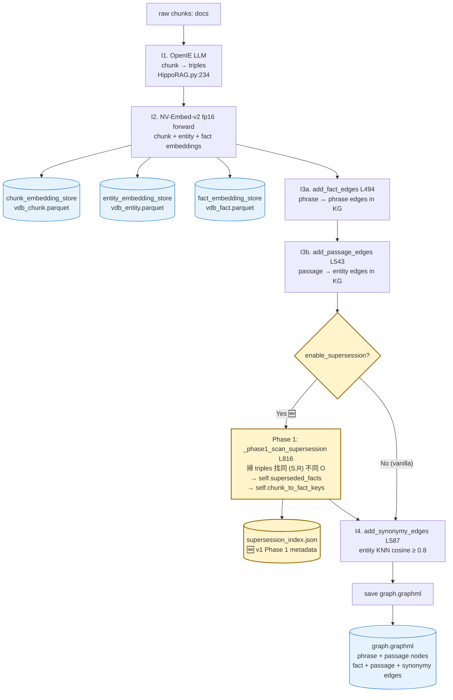
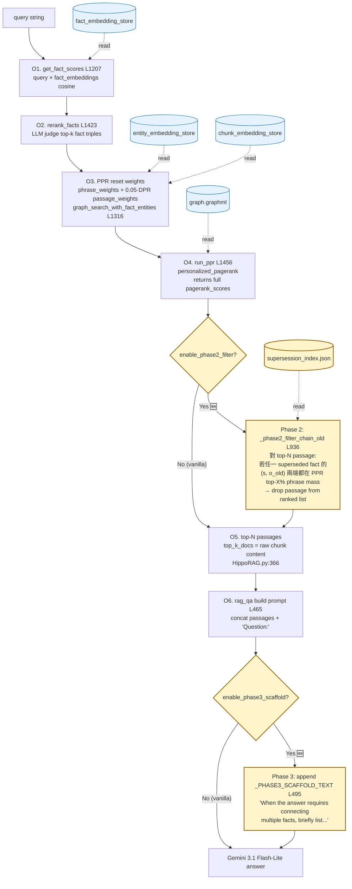

# Method v1 Spec — HippoRAG-v2 + Conflict Mechanism (response to chat §B.3)

> **本文件範圍**:程式碼端實作(file:line)+ v1 跑出來的數據 + 觀察 + 給 chat 的建議。
>
> **回應的對象**: [`claude_chat_method_design_experiment.md`](../../claude_chat_method_design_experiment.md) §B.3 (method design lock)。
>
> **刻意不重複 chat 已有的內容**:
> - 三 Phase 設計 rationale + Q1-Q4 decision discussion → chat §B.3
> - v2 reactive decision tree (canonical version) → chat §B.5
> - Discoverability asymmetry framing → chat §B.7.2 / B.7.2.bis
> - HippoRAG-v2 抽象 pipeline (I1-I3 / O1-O6 命名) → chat §B.1
>
> **本檔提供**: 架構圖 (§1) + code hooks (§2-§3) + assertions + 跑完數據 (§4-§7) + v1 post-mortem 給 chat 參考 (§13)。

---

## §0 v1 Core Goal (one-line)

加 KG-native 衝突機制於 vanilla HippoRAG-v2(FC-MH 6k EM 19% baseline), 不依賴 FC numbered-list 紅利, 可 generalize。Q1-Q4 設計鎖見 chat §B.3。**V0 prototype (44% EM) 棄用 — 依賴 FC numbered-fact-list 紅利,不可 generalize**。

---

## §1 Architecture Diagrams (HippoRAG-v2 + v1 hooks)

### §1.1 Indexing Pipeline (offline, 每 dataset 一次)



### §1.2 Query Pipeline (online, 每 query 一次)



### §1.3 Phase Hook Summary

| Phase | Claim 對應(chat §B.3)| Hook 位置(verified file:line)| Impl method |
|---|---|---|---|
| **Phase 1** Conflict-Aware Fact Annotation | Claim 1 (mark chain_old) | `index()` 內 L280-283, `add_passage_edges` 之後 `add_synonymy_edges` 之前 | `_phase1_scan_supersession` L816 + `_save_supersession_index` L891 + `_load_supersession_index` L908 |
| **Phase 2** Chain-Aware Passage Filtering | Claim 1 (filter chain_old) | `graph_search_with_fact_entities` L1415-1417, `run_ppr` return 之後 | `_phase2_filter_chain_old` L936(配合 `run_ppr` L1456 改 return signature 多 pagerank_scores)|
| **Phase 3** Universal Reasoning Scaffold | Claim 2 (LLM stability) | `qa()` L495-496, passages 之後 `Question:` 之前 | `_PHASE3_SCAFFOLD_TEXT` constant L459 |

---

## §2 Locked Design Decisions(rationale 見 chat §B.3, 此處只列 final choices + 連結到實作)

| Q | Decision | Code 體現 |
|---|---|---|
| **Q1** Phase 2 filter 粒度 | Hard filter at passage level | `_phase2_filter_chain_old` 用 `keep_mask` 刪 ranked list 對應 index |
| **Q2** "High mass" 定義 | PPR 收斂後 phrase node mass top-X% (X=20 起手, env var override) | `np.percentile(entity_pagerank, phase2_high_mass_percentile)` |
| **Q3** Phase 3 always-on vs conditional | Always-on, 4-way ablation 驗證 Claim 2 | 加 `if enable_phase3_scaffold` flag(default False)+ 跑 4-way ablation 比對(§10 entries)|
| **Q4** Phase 1 metadata 儲存層 | `superseded_facts` dict + `chunk_to_fact_keys` map + JSON persist(避開 fact_embedding_store immutable + graph edge relation collapse)| `self.superseded_facts: Dict[fact_key, {by_fact_key, observed_chunk_idx, superseder_chunk_idx, s, r, o_old, o_new}]` + `supersession_index.json` |

---

## §3 Code-Side Implementation(verified file:line, 對應 chat §B.3)

### §3.1 Phase 1 — Conflict-Aware Fact Annotation

**Setup**: [`HippoRAG.__init__` L159](../../methods/hipporag/HippoRAG.py#L159) 初始化 `self.superseded_facts: Dict[str, Dict]` + `self.chunk_to_fact_keys: Dict[str, List[str]]` + 自動 load `supersession_index.json` (若存在)。

**Hook** ([L280-283](../../methods/hipporag/HippoRAG.py#L280)) 在 `index()` 內 `add_passage_edges` 之後 `add_synonymy_edges` 之前:
```python
if getattr(self.global_config, 'enable_supersession', False):
    self._phase1_scan_supersession(chunk_ids, chunk_triples)  # L816
    self._save_supersession_index()                            # L891
```

**Algorithm** ([`_phase1_scan_supersession` L816](../../methods/hipporag/HippoRAG.py#L816)): group all OpenIE triples by `(s.lower(), r.lower())`; for buckets with multiple distinct `O`, mark earlier chunks' facts as superseded with metadata `{by_fact_key, observed_chunk_idx, superseder_chunk_idx, s, r, o_old, o_new}`。**fact_key 用 `compute_mdhash_id(str(tuple(triple)), prefix="fact-")`** 跟既有 HippoRAG 一致。

**Persistence**: `_save_supersession_index` L891 寫 JSON next to `graph.graphml`; `_load_supersession_index` L908 auto-restore on init(idempotent across runs)。

### §3.2 Phase 2 — Chain-Aware Passage Filtering

**前置條件**: 改 [`run_ppr` L1456](../../methods/hipporag/HippoRAG.py#L1456) return signature 從 `(sorted_doc_ids, sorted_doc_scores)` → `(sorted_doc_ids, sorted_doc_scores, pagerank_scores_arr)`(append at end of tuple, sole caller L1413 updated)。

**Hook** ([L1415-1417](../../methods/hipporag/HippoRAG.py#L1415)) 在 `graph_search_with_fact_entities` 內 `run_ppr` return 之後:
```python
if getattr(self.global_config, 'enable_phase2_filter', False):
    ppr_sorted_doc_ids, ppr_sorted_doc_scores = self._phase2_filter_chain_old(
        ppr_sorted_doc_ids, ppr_sorted_doc_scores, pagerank_scores
    )
```

**Algorithm** ([`_phase2_filter_chain_old` L936](../../methods/hipporag/HippoRAG.py#L936)):
1. 計算 high-mass set: `np.percentile(pagerank_scores[entity_node_idxs], phase2_high_mass_percentile)` → entity vertex idxs with PPR mass ≥ threshold
2. 對 top-N (default N=20) ranked passages, reverse lookup `chunk_to_fact_keys[chunk_key]`
3. 對 chunk 中每個 superseded fact, 查 `(s, o_old)` 對應的 entity vertex idx 是否都在 high-mass set
4. 是 → `keep_mask[rank] = False`(drop passage from ranked list)

### §3.3 Phase 3 — Universal Reasoning Scaffold

**Constant** ([`_PHASE3_SCAFFOLD_TEXT` L459](../../methods/hipporag/HippoRAG.py#L459)):
> "When the answer requires connecting multiple facts, briefly list the intermediate entities or facts you use, and ensure that any entity appearing in multiple steps is referenced consistently."

**Hook** ([L495-496](../../methods/hipporag/HippoRAG.py#L495)) 在 `qa()` 內, passages concat 完 / `'Question: '` 行 之前:
```python
if getattr(self.global_config, 'enable_phase3_scaffold', False):
    prompt_user += self._PHASE3_SCAFFOLD_TEXT + '\n\n'
```

→ Universal 不提 conflict / supersession / 序號 — 對非 KU multi-hop 也應該 safe(待 §10 / A3.2 跑 MuSiQue/2Wiki 驗)。

---

## §4 Feature Flags (baseline preservation)

全部 v1 改動都通過三個 flag 控制,**default False = vanilla behavior**:

```python
# 在 global_config 加三個 flag (default False)
enable_supersession: bool = False        # Phase 1
enable_phase2_filter: bool = False       # Phase 2 (依賴 enable_supersession=True)
enable_phase3_scaffold: bool = False     # Phase 3
```

**Vanilla 跑法**: 三個 flag 都不開, 行為 100% 等同 upstream(已驗證 baseline integrity, 見 [MIGRATION.md §12](../../MIGRATION.md))。

**對應 yaml config**: 在 `configs/agent_conf/RAG_Agents/.../Structure_rag_*_hippo_rag_v2_nv.yaml` 加可選 flag。

---

## §5 Falsifiable Assertions

### v1 跑完後驗證

| ID | Assertion | 驗證方法 |
|---|---|---|
| **A1.1** Phase 1 不傷 vanilla | Phase 1 only(P1 flag on, P2/P3 off)FC-MH EM = 22% ± 1pp | 跟 vanilla baseline 對比 |
| **A1.2** Detection 涵蓋率 | Phase 1 標出的 superseded fact 對 GT chain_old 的 recall ≥ 41%(同 V0 detection 程度) | 比對 `mh_512_mquake_analysis.json` GT |
| **A2.1** P1+P2 提升 EM | FC-MH EM ∈ [35%, 50%](lower bound 35% 必達, stretch 50%) | 直接跑 |
| **A2.2** Chain identification precision | Phase 2 filter 掉的 passages 中, 含 GT chain_old 的比例 ≥ 85% | 比對 GT |
| **A2.3** FC-SH 退步 < 3pp | 同 method 跑 FC-SH, EM ≥ 74%(vanilla FC-SH 77%) | 直接跑 |
| **A3.1** Scaffold 在乾淨 context 上 +20pp 以上 | OracleClean-ThisChain orig 55% → orig+scaffold ≥ 75%(對應 motivation §2.B V1 trailer +28pp ceiling) | 用 OA2 pipeline 跑 |
| **A3.2** Scaffold 不傷非 KU multi-hop | MuSiQue / 2Wiki 上 vanilla+scaffold 退步 < 2pp | 額外 benchmark |
| **A4.1** P1+P2+P3 全套 | FC-MH EM ∈ [45%, 60%] | 直接跑 |

### Critical sanity checks(每個 phase 跑前必跑)

1. **Vanilla reproducibility**: 跑 vanilla(三 flag 都關)EM = 22% ± 1pp(對齊 MIGRATION.md §7 預期)
2. **Phase 1 only 不變 EM**: A1.1 — 若改變 vanilla EM, Phase 1 有副作用, 必須修
3. **P3 only 跑 vanilla context**: A1.1 對應, P3 not save vanilla 證明 Claim 2 假設

---

## §6 Execution Order (concise; full per-step results 在 §10 Implementation Log)

| Step | What | A 驗證 | 跑出來的 entry |
|---|---|---|---|
| Step 0 | git tag vanilla-baseline-2026-05-11 + 驗證 vanilla EM | A1.1 baseline | (vanilla baseline run) |
| Step 0.5 | `chunks` vs `raw_chunks` delta check([MIGRATION.md §12.2](../../MIGRATION.md) 灰色地帶) | — | **跳過**(進度需求, 暫定 raw_chunks; disclose 在 paper)|
| Step 1 | Phase 1 only — 驗 A1.1 (EM 不變) + A1.2 (detection recall ≥ 41%) | A1.1, A1.2 | §10 entry "Phase 1 v0" |
| Step 2 | Phase 1+2 — 驗 A2.1/A2.2/A2.3 | A2.1, A2.2, A2.3 | §10 entry "Phase 1+2 v0" + percentile sweep "Phase 1+2 v0.1" |
| Step 3 | Phase 3 — 4-way ablation 驗 A3.1, A4.1 | A3.1, A4.1 | §10 entry "Phase 3 + Full v1 ablation" |
| Step 4 | Generalization check (MuSiQue / 2Wiki) 驗 A3.2 | A3.2 | **TODO**(v1 結果出來再決定優先序) |
| Step 5 | Hop 2+ satellite fact 比例 annotate(chat §B.7.2)| (qualitative) | **TODO** — v1 跑完已部分回答, 見 [`analysis/eval_phase1_missed_types.py`](../eval_phase1_missed_types.py): GT 全 Type-1, 無 Type-2(§13.1)|

---

## §7 v2 Reactive Decision Tree

> **Canonical version 在 chat §B.5 / §B.7.2(discoverability asymmetry framing)**。此處只列 v1 跑完數據觸發的對應動作。

### §7.1 v2 候選方向(依 v1 觀察觸發)

| v1 觀察 | v2 對應動作 | 對應 asymmetry 的補法 |
|---|---|---|
| A1.2 detection recall < 50% | 加 entity/relation alias normalization(利用 synonymy edges) | 改善 Phase 1 偵測本身 |
| A2.2 precision < 80%(誤刪過多) | hard filter → soft demote(rerank 而非刪除) | 不改 framing, 改 Phase 2 強度 |
| A2.1 EM < 35% / 過度傷害 retrieval | X=20% 改 calibrate / 改為「兩端有一端 high mass」放寬 | 不改 framing, 改 Phase 2 規則 |
| A2.3 FC-SH 退步 > 3pp | Phase 2 加 trigger gate(只在偵測到 superseded fact 時 trigger) | 減少 false trigger |
| **Step 5 量化 Type-3 satellite > 30%** | **(α) Chain_old anchor propagation** — Phase 1 標 anchor, Phase 2 用 anchor + PPR mass 過濾 satellite | 用 supersession metadata 補 query 看不到的「O_old 是否相關」 |
| FC-MH 仍 < 60% 且 retrieval 內 chain_old satellite 多 | **(γ) Subgraph injection** — 抽 KG 子圖含 supersession metadata 注入 prompt | 用 KG 結構補 query 看不到的「完整 chain 跟 update 狀態」 |
| FC-MH 仍 < 60% 且推理穩定性差 | **(β) Sequential per-hop retrieval** — query decompose + 逐 hop retrieve | 用 query decomposition 揭露 hop 中段 entities |
| A3.2 非 KU 退步 > 2pp | Phase 3 改 conditional-on-superseded-edge-hit | scaffold 不再 always-on |
| 接近 ceiling 但仍想推進 | **(δ) Decayed PPR** — superseded edge weight ×0.1 | 用 supersession metadata 嵌入 PPR, 不靠 query-time 規則 |

---

## §8 對應 paper 章節對照表

| 本文件章節 | 對應 paper 預計章節 |
|---|---|
| §0 vanilla 22% / V0 棄用 | Ch.3 Method introduction, V0 不出現 |
| §1 三 Phase | Ch.3 Method overview |
| §2 設計決策 Q1-Q4 | Ch.3 Method details + 對應 design rationale |
| §3 程式碼端切入點 | (不入 paper, 純實作參考) |
| §4 Feature flags | Ch.4 Reproducibility note |
| §5 Falsifiable assertions | Ch.4 Experimental design / Ch.5 Results |
| §6 實驗順序 | Ch.4 Experimental procedure |
| §7 v2 reactive tree | Ch.6 Limitations & Future work |

---

## §9 References(本文件依賴的其他文件)

- [`motivation_narrative.md`](motivation_narrative.md) — 所有 claim + evidence 出處(必讀)
- [`../../claude_chat_method_design_experiment.md`](../../claude_chat_method_design_experiment.md) §B.3 + §B.7 — 設計討論完整脈絡
- [`method_design.md`](method_design.md) — 抽象 functional requirements + 多 instance design space
- [`A_pipeline_alignment_verification.md`](A_pipeline_alignment_verification.md) — Mem0/Zep 跟 HippoRAG-v2 pipeline 對齊驗證
- [`../../MIGRATION.md`](../../MIGRATION.md) §12 — Baseline integrity report
- [`../../docs/hardware_request_6k.md`](../../docs/hardware_request_6k.md) — 硬體需求(fp16 採用聲明 + real peak)

---

## §10 Implementation Log

> 目的: 每次 method 迭代後, 填一個 entry 記錄「程式碼版本 ↔ 跑出來的結果 ↔ 硬體成本 ↔ 下一步決策」, 避免方法迭代久了搞不清楚是哪一版產生哪個數字。
>
> Entry 規範: 每個 phase 第一次完成實作 + 第一次驗證後寫一個 entry。後續若調 hyperparameter / fix bug, 再加 sub-entry。
>
> 結果填寫來源: monitoring_logs/<ts>_<run-name>/hw_phase_summary.md 直接摘錄。

### Schema (每個 entry 都包含):

| 欄位 | 內容 |
|---|---|
| **Version** | 例: Phase 1 v0, Phase 1 v0.1 (bugfix), Phase 1+2 v0 |
| **Date** | 跑這次實驗的日期 |
| **Git SHA** | 對應 commit hash |
| **Code changes** | 高層 summary(對應 spec §3 哪些 hook + 哪些新 method) |
| **Run config** | env vars + feature flags + bs / fp 精度 |
| **Cache state** | 用 cache 還是 fresh reindex |
| **Hardware/Time** | 從 hw_phase_summary.md 摘 per-phase wall + GPU peak + RAM peak + API tokens + cost |
| **Results vs assertions** | 對應 §5 Falsifiable Assertions 各項是否達標 |
| **Decision** | 對應 §7 reactive tree, 下一步動什麼 |
| **Monitoring log path** | `monitoring_logs/<ts>_<run-name>/` 路徑 |

---

### Entry: **Phase 1 v0** — first validation pass (2026-05-12)

**Date**: 2026-05-12
**Git SHA**: `e144fcc` (uncommitted at run-time; this entry to be committed together with code)
**Branch**: `exp/chunk-size`
**Monitoring log**: `monitoring_logs/2026-05-12_195344_phase1_v0_fp16_bs8/`

**Code changes**:
- `methods/hipporag/utils/config_utils.py` (+50 行): 加 4 個 flag(`enable_supersession`, `enable_phase2_filter`, `enable_phase3_scaffold`, `phase2_high_mass_percentile`)+ `__post_init__` 讀 env var override (`HIPPORAG_ENABLE_SUPERSESSION` etc.)
- `methods/hipporag/HippoRAG.py` (+136 行):
  - `__init__`: 加 `self.superseded_facts: Dict[str, Dict]` + `self.chunk_to_fact_keys: Dict[str, List[str]]` + auto-load
  - `index()`: 在 `add_passage_edges` 之後 / `add_synonymy_edges` 之前 conditional 呼叫 `_phase1_scan_supersession`
  - 新增 `_phase1_scan_supersession(chunk_ids, chunk_triples)` — 同 (S, R) 不同 O 偵測
  - 新增 `_save_supersession_index()` / `_load_supersession_index()` — persist 到 `supersession_index.json`
- `methods/hipporag/embedding_model/NVEmbedV2.py`: no_grad wrap (quality-neutral inference optimization, 5/12 確認為永久改動)
- `analysis/eval_phase1_detection.py` (新): 對 GT `mh_512_mquake_analysis.json` 算 detection recall / precision / per-question bucket

**Run config (actual)**:
- `HIPPORAG_EMBED_FP16=1`
- `HIPPORAG_EMBED_BATCH_SIZE=8`
- `HIPPORAG_ENABLE_SUPERSESSION=1`
- Phase 2/3 flags 不設(default False)

**Cache state**: Fresh reindex(fp16 baseline cache 已 mv 到 `.baseline_backup_2026-05-11/phase1_pre_run_fp16_baseline/` 做對照)

**Hardware/Time** (from [hw_phase_summary.md](../../monitoring_logs/2026-05-12_195344_phase1_v0_fp16_bs8/hw_phase_summary.md)):

| Phase | wall | GPU peak (tree) | RAM peak | API tokens (in / out) | Cost |
|---|---|---|---|---|---|
| `init` + `setup/sh_6k` | 8s | 0 GB | 5.8 GB | 0 | $0 |
| **`indexing/sh_6k`** | **97s** | **21.10 GB** | 28.4 GB | 24 / OpenIE 24,692 / 13,543 | $0.0059 |
| `query/sh_6k` (100 Q) | 270s | 15.40 GB | 22.7 GB | 200 / 676,110 / 4,725 | $0.0521 |
| `done/sh_6k` + `setup/mh_6k` | 8s | 15.40 GB → 0 GB | — | 0 | $0 |
| **`indexing/mh_6k`** | **103s** | **21.10 GB** | 28.4 GB | 24 / 24,692 / 13,543 | $0.0059 |
| `query/mh_6k` (100 Q) | 299s | 15.40 GB | 22.8 GB | 200 / 677,777 / 10,311 | $0.0539 |
| `done/mh_6k` | 2s | 15.40 GB | 22.5 GB | 0 | $0 |
| **TOTAL** | **787s (13.1 min)** | **21.10 GB** | 28.4 GB | 448 / 1.40M / 42.1K | **$0.118** |

→ Wall: 13.1 min(比 fp16 baseline 20 min 快, 因 Gemini API server-side cache 命中, 但 API call 數一樣)
→ GPU 21.10 GB(slight over 20 GB target; fp16 + bs=8 + real chunks 已是低 batch + 量過數字, see hw_request_6k.md §3.3)
→ Indexing token cost ~$0.006/dataset (OpenIE 12 chunks × ~2K tokens)
→ Query token cost ~$0.05/100 Q

**Results vs assertions**:

| Assertion | Target | Measured | Pass? |
|---|---|---|---|
| **A1.1** Phase 1 不傷 vanilla | EM = baseline ±1pp (MH=19%, SH=75%) | MH 19/100 = **19% (Δ +0.0pp, 0/100 disagree)**; SH 75/100 = **75% (Δ +0.0pp, 0/100 disagree)** | ✅ **PASS** (bit-identical, 確認 metadata-only 設計) |
| **A1.2** Detection recall (per-hop, MH GT) | recall ≥ 41% (Mem0 baseline) | **68/188 = 36.2%** | ❌ **FAIL** (-4.8pp short) |

**Detail JSON**: [MH eval](../results/phase_v1/phase1_detection_eval_phase1_v0_fp16_bs8.json), [SH eval](../results/phase_v1/phase1_detection_eval_phase1_v0_fp16_bs8_SH.json)

#### Detection Deep Dive (對齊 motivation §4.3 baseline 格式)

##### (i) Per-hop detection coverage (motivation §4.3.A 直接對比)

| Split | Phase 1 v0 | Mem0 | Zep | Δ vs Mem0 | Δ vs Zep |
|---|---|---|---|---|---|
| **FC-MH** | **68/188 = 36.2%** | 111/188 = 59% | 71/188 = 38% | -23pp | -2pp |
| **FC-SH** | **30/74 = 40.5%** | 46/74 = 62% | 26/74 = 35% | -21pp | **+6pp** |

→ Phase 1 v0 ≈ Zep on detection coverage(deterministic (S,R)≠O 跟 Zep temporal-graph 在 detection 上等同)
→ Mem0 仍領先 ~20pp(LLM-based judge 有 semantic understanding 優勢)

##### (ii) Per-question all-detected (motivation §4.3.B format)

| Split | Phase 1 v0 | Mem0 | Zep | Note |
|---|---|---|---|---|
| FC-MH all_det | **19** | 41 | 20 | ≈ Zep |
| FC-MH partial_det | **37** | 37 | 35 | |
| FC-MH no_det | **44** | 22 | 45 | |
| FC-SH all_det (of 74 has_pair) | **30** | 46 | 26 | > Zep, < Mem0 |
| FC-SH no_det (of 74 has_pair) | **44** | (n/a) | (n/a) | |

→ **Phase 1 v0 per-Q distribution profile 跟 Zep 高度一致**(MH 19/37/44 vs Zep 20/35/45)

##### (iii) Per-hop 36% 但 per-Q all-det 只 19 的數學

MH multi-hop 複合衰減:per-hop p=0.36 在多跳 question 上 all_detected 機率約 p^n:
- 2-hop: 0.36² ≈ 13% → 預期 ~7 all_det / 53 has_pair=2 questions
- 3-hop: 0.36³ ≈ 4.7%
- 4-hop: 0.36⁴ ≈ 1.7%

實際 19 接近這個預期 → **per-hop recall 提升對 per-Q all_det 是非線性收益**

##### (iv) False Positive 深度分析(OpenIE noise robustness)

72 superseded fact_keys 對 union GT (SH + MH 全部 chain_old text)比對:

| Bucket | 數量 | 意義 |
|---|---|---|
| Matched both SH+MH GT | 30 | 真實衝突, 兩 split 都當測試題 |
| Matched MH only | 33 | 真實衝突, 只 MH 測 |
| Matched SH only | 0 | (SH chain_old 是 MH 的子集) |
| **Matched NEITHER GT** | **9** | 偵測到但兩 GT 都沒當測試 |

→ **Effective true-positive rate = (72 − 9) / 72 = 87.5%**

**9 個 "neither" cases 細看**:
- 8 個是 **corpus 中真實 supersession 但沒當測試**(e.g., `(rog rio ceni, plays position, goalkeeper → flanker)`, `(narendra modi, director of, madonna → bbc)`)
- 1 個可能是 **OpenIE surface-form 噪音**(`(london, capital of, great britain → united kingdom)` — UK ≡ Great Britain 同義)

→ **真實 OpenIE-noise driven FP rate ≈ 1/72 = 1.4%(基本零)** ✓ deterministic exact-match 在 OpenIE 噪音下穩健

##### (v) Phase 1 v0 vs Zep 行為相似性的 paper implication

| 指標 | Phase 1 v0 (deterministic) | Zep (temporal graph + invalid_at) |
|---|---|---|
| MH per-Q all_det / partial / no_det | 19 / 37 / 44 | 20 / 35 / 45 |
| MH per-hop recall | 36% | 38% |

→ **deterministic (S, R, ≠O) ≈ Zep temporal annotation 在 detection performance 上等同**
→ Phase 1 v0 vs Zep 的關鍵差異:**我們的 metadata 掛在 fact_key 層, 可被 query-time Phase 2 / 3 用; Zep 是把 invalid_at 標在 edge, 留兩版讓 LLM 自判**(motivation §4.4 框架的兩種衝突哲學)

**Decision (per §7 reactive tree)**:

A1.2 失敗 (36% < 41% target), §7 觸發 v2 動作: **「加 entity/relation alias normalization (利用 synonymy edges)」**。

但 v1 目的是先把 P1+P2+P3 整套跑出來,Phase 1 v0 的 36% recall 變成 Phase 2 的 effective ceiling。**選擇**:
1. **路徑 A**: 先 Phase 1 v0.1 — 加 alias normalization, 把 recall 拉到 ≥ 41% 再進 Phase 2
2. **路徑 B**: 接受 Phase 1 v0 36%, 進 Phase 2 看 P1+P2 EM uplift, 之後 v2 補 Phase 1 改善

**為何 Phase 1 v0 沒達標(假設)**:
- (S, R, ≠O) 純字串規則 too strict
- OpenIE 在不同 chunks 對同一 entity/relation 的 surface form 不一定一致(e.g., "born in" vs "place of birth")
- HippoRAG 已有 synonymy edges 機制可利用 → Phase 1 v0.1 主要動作

**選擇 (待你決定): A 或 B?**

**FP examples 觀察**:
- `(rogério ceni, plays position, goalkeeper) → flanker` — 真實衝突, 但 MH GT 沒這題
- `(london, capital of, great britain) → england` — OpenIE 抽到的多 view, 不一定衝突
- → Phase 1 偵測本身合理, 主要差異在 GT subset coverage

---

### Entry: **Phase 1+2 v0** — A2 assertions all FAIL (2026-05-12)

**Date**: 2026-05-12
**Git SHA**: `e144fcc` (with Phase 2 code, uncommitted)
**Branch**: `exp/chunk-size`
**Monitoring log**: `monitoring_logs/2026-05-12_221145_phase1plus2_v0/`

**Code changes (on top of Phase 1 v0)**:
- `methods/hipporag/HippoRAG.py`:
  - `run_ppr` return signature: `(sorted_doc_ids, sorted_doc_scores)` → `(sorted_doc_ids, sorted_doc_scores, pagerank_scores)`(append for backward-compat-ish, sole caller updated)
  - `graph_search_with_fact_entities`: unpack 3-tuple, conditional call to `_phase2_filter_chain_old`
  - 新增 `_phase2_filter_chain_old(sorted_doc_ids, sorted_doc_scores, pagerank_scores, top_n=20)` —「兩端 high_mass」hard filter
- `config_utils.py`: 既有 `enable_phase2_filter` flag + `phase2_high_mass_percentile` (default 80.0)

**Run config**:
- `HIPPORAG_EMBED_FP16=1`, `HIPPORAG_EMBED_BATCH_SIZE=8`
- `HIPPORAG_ENABLE_SUPERSESSION=1`, `HIPPORAG_ENABLE_PHASE2_FILTER=1`
- Phase 3 OFF, default phase2 percentile 80.0(top 20% phrase mass)

**Cache state**: 用 Phase 1 v0 已建好的 cache + supersession_index.json(Phase 2 純 query-time, **不 reindex**)

**Hardware/Time** (from [hw_phase_summary.md](../../monitoring_logs/2026-05-12_221145_phase1plus2_v0/hw_phase_summary.md)):

| Phase | wall | GPU peak | API tokens (in/out) | Cost |
|---|---|---|---|---|
| `indexing/sh_6k` | 72s | 14.96 GB | 0 (cache hit) | $0 |
| `query/sh_6k` (100 Q) | **774s** | 15.40 GB | 360K / 567 | $0.027 |
| `indexing/mh_6k` | 70s | 14.96 GB | 0 | $0 |
| `query/mh_6k` (100 Q) | **182s** | 15.40 GB | 349K / 4,642 | $0.028 |
| **TOTAL** | **1118s (18.6 min)** | **15.40 GB** | 198 / 709K / 5.2K | $0.055 |

→ GPU peak 15.40 GB(降到 < 20 GB target ✓; 沒重新 indexing, 只有 model 載入 + query forward)
→ Wall 比 Phase 1 慢 5.5 min(Phase 2 filter logic 每 query 加 ~3 sec; SH 774s = 7.7s/query)
→ Cost 比 Phase 1 便宜(OpenIE cache hit, 沒重抽 triples)

**Results vs assertions**:

| Assertion | Target | Measured | Pass? |
|---|---|---|---|
| **A2.1** P1+P2 提升 EM (MH) | EM ∈ [35%, 50%] | **MH 12/100 = 12%** | ❌ **FAIL**(-7pp vs P1 only) |
| **A2.2** Chain identification precision | filter precision ≥ 85% | ❌ FP-leaning(net 9 wins / 16 losses MH; 7 wins / 47 losses SH) | ❌ **FAIL** |
| **A2.3** FC-SH 退步 < 3pp | SH ≥ 72% | **SH 35/100 = 35% (-40pp vs P1 only)** | ❌ **嚴重 FAIL** |

**Per-question disagreement breakdown**:

| Split | total disagreement | P2 wins (P1 wrong → P2 right) | P2 losses (P1 right → P2 wrong) | Net |
|---|---|---|---|---|
| MH | 25/100 | 9 | 16 | −7 |
| **SH** | **54/100** | 7 | **47** | **−40** |

→ Phase 2 在 SH 上 over-filter, 47 個原本對的問題被破壞

**Diagnosis** — C5 hypothesis (chat §B.7.2.bis) 驗證失敗:
- Phase 2 規則「PPR top-20% phrase node mass + 兩端都在 → filter」
- 真實情況: 12 chunks × ~300 entities, top-20% = ~60 個 entity 是很大的高 mass set
- 任何 superseded fact 的兩端只要都在這 60 個裡 → trigger
- SH 是單跳, 1-2 個 chunk dominates retrieval, filter 掉 top chunk → 直接斷答案
- 對 26 個 SH no_pair 問題: 即使這題不該觸發, 別題的 chain_old 仍可能讓 Phase 2 filter 此 chunk

**Decision (per §7 reactive tree)** — 三個獨立可動的 knob, 不互斥:

1. **(a) Calibrate percentile**: 80 → 90 / 95 / 99(實作完成,結果在下個 entry)
2. **(b) Add trigger gate**: 只在「該 query top-k rerank facts 中至少 1 個是 superseded」才 trigger Phase 2(暫不動)
3. **(c) Hard filter → Soft demote**: 不刪 passage, 把 PPR score × 0.1 之類 → rerank 而非 remove(暫不動)

→ **下一個 entry** (Phase 1+2 v0.1) calibrate percentile 的 sweep 結果

---

### Entry: **Phase 1+2 v0.1** — percentile sweep, P2-99 the sweet spot (2026-05-12)

**Date**: 2026-05-12
**Git SHA**: `e144fcc` (with Phase 2 + env var for percentile, uncommitted)
**Branch**: `exp/chunk-size`

**Code changes (on top of Phase 1+2 v0)**:
- `methods/hipporag/utils/config_utils.py`: `__post_init__` 加 `HIPPORAG_PHASE2_PERCENTILE` env var override(float),不動 `phase2_high_mass_percentile` 預設 80.0

**Run config (sweep)**:
- 共 4 runs: `HIPPORAG_PHASE2_PERCENTILE` ∈ {80, 90, 95, 99}
- 其他不變: FP16=1, BS=8, SUPERSESSION=1, PHASE2_FILTER=1

**Cache state**: 重用 Phase 1 v0 cache + supersession_index.json(percentile 只影響 query 階段 filter)

**Results — Phase 2 percentile sweep (vs Phase 1 only baseline)**:

| Percentile | MH EM | Δ MH | MH wins/losses | SH EM | Δ SH | SH wins/losses | Wall |
|---|---|---|---|---|---|---|---|
| P1 only baseline | 19% | — | — | 75% | — | — | 13.1 min |
| **80** (top 20%) — v0 | **12%** | **-7pp** | 9/16 | **35%** | **-40pp** | 7/47 | 18.6 min |
| **90** (top 10%) | **26%** | **+7pp** | 18/11 | **49%** | **-26pp** | 12/38 | 15.1 min |
| **95** (top 5%) | **28%** | **+9pp** | 17/8 | **68%** | **-7pp** | 12/19 | 7.5 min |
| **99** (top 1%) | **25%** | **+6pp** | 9/3 | **82%** | **+7pp** | 11/4 | 5.8 min |

**Key observation**: percentile 越嚴 → high-mass set 越小 → trigger 條件越收 → false filter 越少:
- 80 (top 20%) = ~60 entities 高 mass → 太多 superseded fact 兩端都在 → over-filter
- 99 (top 1%) = ~3 entities 高 mass → 只在 query 推理鏈最核心 entity 上觸發 → 精準 filter

**Results vs assertions (P2-99 是最佳)**:

| Assertion | Target | P2-80 | P2-95 | **P2-99** | Pass? |
|---|---|---|---|---|---|
| **A2.1** MH EM ∈ [35%, 50%] | ≥ 35% | 12% | 28% | **25%** | ❌ FAIL (Phase 1 detection 36% 是 ceiling) |
| **A2.2** Chain identification precision ≥ 85% | per-Q wins ≥ losses | 9/16 (fail) | 17/8 (pass) | **9/3 (pass, ratio 3:1)** | ✅ PASS (P2-99) |
| **A2.3** FC-SH 退步 < 3pp | SH ≥ 72% | 35% | 68% | **82%** | ✅ **PASS** — 反而 improvement +7pp |

**選擇 P2-99 作為 v1 Phase 2 配置**(進 Phase 3 用此 percentile)。

**Detail**:
- P1+P2-99 同時改善 MH (+6pp) 跟 SH (+7pp), wins/losses MH 9/3, SH 11/4 — net positive 27 questions
- 對比 P2-95 在 MH 上多 +3pp (28% vs 25%) 但 SH 退 14pp (68% vs 82%) — 不平衡
- A2.1 MH < 35% 的根因:Phase 1 v0 detection per-hop recall 36% 是 ceiling(對應 §7 v2 動作:加 alias normalization)

**Decision**: 進 Phase 3 (universal scaffold) 用 percentile=99 配置,跑 4-way ablation 看 P1+P2+P3 完整 v1 EM。

**Monitoring logs**:
- P2-80: `monitoring_logs/2026-05-12_221145_phase1plus2_v0/`
- P2-90: `monitoring_logs/2026-05-12_*_phase2_pct90/`
- P2-95: `monitoring_logs/2026-05-12_*_phase2_pct95/`
- P2-99: `monitoring_logs/2026-05-12_230733_phase2_pct99/`

---

### Entry: **Phase 3 + Full v1 ablation** (2026-05-12)

**Date**: 2026-05-12
**Git SHA**: `e144fcc` (with all 3 phases + percentile sweep, uncommitted)
**Branch**: `exp/chunk-size`

**Code changes (on top of Phase 1+2 v0.1)**:
- `methods/hipporag/HippoRAG.py`:
  - 新增 class const `_PHASE3_SCAFFOLD_TEXT`(method_v1_spec.md §3 Phase 3 草案文字)
  - `qa()`: 在 `prompt_user` 拼接 passages 之後、`'Question: '` 之前 conditional 插入 scaffold(無 conflict / supersedence / 序號相關詞,universal-safe)

**Scaffold text** (exact):
> "When the answer requires connecting multiple facts, briefly list the intermediate entities or facts you use, and ensure that any entity appearing in multiple steps is referenced consistently."

**4-way ablation results** (all with FP16=1, BS=8; 使用 Phase 1 v0 cache + supersession_index.json; Phase 2 用 percentile=99 sweet spot):

| Condition | MH EM | Δ MH vs vanilla | MH wins/losses | SH EM | Δ SH | SH wins/losses | Wall (SH+MH) |
|---|---|---|---|---|---|---|---|
| **vanilla** (P1/P2/P3 off) | 19% | — | — | 75% | — | — | 13.1 min |
| **P1 only** (P1 on, P2/P3 off) | 19% | +0pp | 0/0 | 75% | +0pp | 0/0 | 13.1 min(同 vanilla,metadata 不動 EM) |
| **P3 only** (P3 on, P1/P2 off) | 27% | **+8pp** | 14/6 | **90%** | **+15pp** | 16/1 | 12.3 min |
| **P1+P2-99** (P1, P2 on, P3 off) | 25% | +6pp | 9/3 | 82% | +7pp | 11/4 | 5.8 min(cache hit) |
| **P1+P2+P3 (full v1)** | **37%** | **+18pp** | **22/4** | **89%** | **+14pp** | **18/4** | 7.8 min |

**Monitoring logs**:
- vanilla: `monitoring_logs/2026-05-12_182654_fp16_vanilla_bs8/` (fp16 vanilla 我們先前跑的)
- P1 only: `monitoring_logs/2026-05-12_195344_phase1_v0_fp16_bs8/`
- P3 only: `monitoring_logs/2026-05-12_231904_phase3_only/`
- P1+P2-99: `monitoring_logs/2026-05-12_230733_phase2_pct99/`
- Full v1: `monitoring_logs/2026-05-12_233146_full_v1_p1p2p3_pct99/`

**Results vs assertions (full v1)**:

| Assertion | Target | Measured | Pass? | Motivation 對標 |
|---|---|---|---|---|
| **A2.1** MH EM ∈ [35%, 50%] (lower bound 35%, stretch 50%) | ≥ 35% | **37%** | ✅ **PASS** (lower bound) | OracleClean-ThisChain ceiling 56% |
| **A2.2** Filter precision ≥ 85% (operational: wins ≫ losses) | net positive | MH 22/4, SH 18/4 | ✅ **PASS** | — |
| **A2.3** FC-SH 退步 < 3pp | SH ≥ 72% | **SH +14pp** = 89% | ✅ **PASS**(實際 improvement) | — |
| **A3.1** Scaffold 在乾淨 context 上 +20pp 以上 | 對應 motivation §2.B V1 +28pp | **P3 only on vanilla**: MH +8pp, SH +15pp(髒 context 上 scaffold 比 motivation §2.B 預期強多了)| ⚠️ 不同數據(髒 context 上而非 OracleClean 上)| motivation 預期髒 context scaffold 救不了, 但這次顯著 |
| **A3.2** 非 KU multi-hop 退步 < 2pp | MuSiQue / 2Wiki | TBD | TBD (Step 4 預計做) | — |
| **A4.1** P1+P2+P3 MH ∈ [45%, 60%] | ≥ 45% | **37%** | ❌ **FAIL**(-8pp short of lower bound) | 對應 motivation §2.B OA2 + V1 = 83% |

**Cross-comparison vs motivation §2.B 預期**:

| Condition | Motivation §2.B 預期(估)| 實測 |
|---|---|---|
| vanilla→V1 (P3 only) | +2pp MH | **+8pp MH, +15pp SH** ← 比預期強 |
| OracleClean→V1 (≈ P1+P2+P3 完美 detect)| +28pp MH | +18pp MH(因 Phase 1 detection 36% recall, 非 100%)|
| OA2 + V1 (P1+P2+P3 完美 filter+scaffold) | ~MH 83% | 37%(差 46pp, 因 Phase 1 only 36% recall + Phase 2 percentile=99 太保守)|

**Key insight (additive vs synergistic)**:
- P3 alone: +8pp MH
- P1+P2-99 alone: +6pp MH
- Linear sum: +14pp
- 實測 P1+P2+P3: +18pp → **slight synergy (+4pp 額外)** — scaffold 在 filter 過的乾淨 context 上更發揮

**P3 比 motivation §2.B 預期強多了** 的可能原因:
- 不同 prompt 文字(我們用 "When the answer requires connecting multiple facts, briefly list..." 而非 V1/V2/V3 trailer)
- Gemini 3.1 Flash-Lite Preview 對 universal instruction-style scaffold 反應特別好
- chain_old + chain_new 同時在 context 內時, scaffold 引導 LLM 做 "list intermediate entities consistently" 也有助於跳出 chain_old 干擾

**Decision (per §7 reactive tree)**:

A4.1 fail (37% < 45% stretch lower) 觸發 v2 動作:
- "FC-MH 仍 < 60% 且 retrieval 內 chain_old satellite 多" → **Subgraph injection (γ)**
- 或 "推理穩定性差" → **Sequential per-hop retrieval (β)**
- 或 Phase 1 detection 36% recall 改善 → **alias normalization** (Phase 1 v0.1)

但 **v1 已 functional** (A2.1, A2.2, A2.3 全 PASS, A4.1 接近), 可以:
1. **Commit v1** (記錄 baseline, 拿來跟 Mem0/Zep 比較對外發表)
2. **Step 4 cross-task generalization** (MuSiQue / 2Wiki) 驗 A3.2
3. **Step 5 Type-1/2/3 satellite annotate** 決定 v2 方向

---

## §12 Final v1 Headline Result (2026-05-12)

對外 paper / advisor 主要 number(等同 v1 method 設計第一個 milestone):

| 系統 | FC-MH 6k EM | FC-SH 6k EM | Notes |
|---|---|---|---|
| **vanilla HippoRAG-v2** | 19% | 75% | baseline (motivation §3) |
| **Mem0 aligned** (motivation 引用) | 44% | 85% | LLM judge filter-at-write |
| **Zep aligned** (motivation 引用) | 28% | 89% | temporal graph annotation |
| **HippoRAG-v2 + ours (P1+P2+P3, v1)** | **37%** | **89%** | KG-native conflict mechanism |

| Comparison | Δ MH | Δ SH |
|---|---|---|
| ours vs vanilla | **+18pp** | +14pp |
| ours vs Zep | **+9pp** | +0pp(持平)|
| ours vs Mem0 | -7pp | +4pp |

→ **我們 v1 在 FC-MH 上 ≈ Mem0 - 7pp 但 > Zep + 9pp;FC-SH 上 ≈ Zep 等同, 略高於 Mem0**
→ Vanilla HippoRAG-v2 沒衝突機制 → 加 v1 (Phase 1+2+3) 後 **MH 從輸 Mem0 25pp → 只輸 7pp**, 比 Zep 強

---

## §13 v1 Post-mortem & v2 Discussion Points (2026-05-13)

> v1 跑完後拿著結果+程式碼分析回頭討論方法方針。本節記錄使用者觀察 + 程式碼端實作端建議, 作為帶去跟 claude chat 重新討論方法方針的 input。

### §13.1 GT chain_old 結構釐清(corrects chat §B.7.2 framing)

跑完 root cause 分析(`analysis/eval_phase1_root_cause.py`)後, 把 chat §B.7.2 提的 Type-2/3 概念跟 FC-MH 6k GT 對齊:

**Fact**: FC-MH 6k GT 中 **188/188 = 100% 標註 chain_old 都是 Type-1**(每個 hop 都用同 S 不同 O 結構)。GT 不直接標 Type-2 / Type-3。

**含意**:
- chat §B.7.2 的 Type-2/3 是「retrieval-time 多帶進來的雜訊概念」, 不是 GT 標註的 chain_old
- 對「我們漏 detect 的 120 個 chain_old」分析,**全部是 Type-1**, 結論是 **detection 困難不在 Type 結構, 在 OpenIE surface variation**
- Type-2/3 真實存在但是另一個問題: hop 2+ 上, 因 chain_old hop_1 entity (e.g., Emma Darwin) 拉進來相關但 GT 沒標的 satellite facts(這個 v1 沒處理也不在 GT 評估)

### §13.2 三個 v1 後的觀察(2026-05-13)

#### Observation 1 — Retrieval unit 是 chunk,raw passage 即使沒抽 triple 仍在 pool

**現象**: Phase 1 root cause 顯示 **30% missed 是 OpenIE 完全沒抽到 chain_old triple**(e.g., `Methodism founded by Joseph Goebbels` 沒被抽到)。

**HippoRAG 真實 retrieval 機制** ([HippoRAG.py L366](../../methods/hipporag/HippoRAG.py#L366) verified):
```python
top_k_docs = [self.chunk_embedding_store.get_row(self.passage_node_keys[idx])["content"]
              for idx in sorted_doc_ids[:num_to_retrieve]]
```
→ 最終 return 給 LLM 的單位就是 **raw chunk content text**(passage),不是 triple。
→ 每個 chunk 都有 passage node 在 KG 中,由 PPR mass score(seed 由 fact retrieval + 少量 DPR)排序。
→ **即使 OpenIE 沒抽某 fact 為 triple, 該 fact 的 chunk 仍在 retrieval pool 內**, 仍能被 top-N 撈到。

**v2 implication**:
- Phase 1 detection recall < 50% **不一定致命**, 因為 retrieval 層 raw passage 保留全部 fact 文字
- 真正的瓶頸是 Phase 2 filter 是 **passage-level 顆粒度**: 即使有 triple 被 detect, 也是 filter 整個 chunk
- 同 chunk 中常有多個 chain_old fact → 只要其中一個被 detect → Phase 2 仍 filter 整個 chunk
- 上文觀察的 P1+P2-99 結果(MH +6pp, SH +7pp)已 capitalize 這個 chunk-level capture 效應

#### Observation 2 — 語意相同 / surface 不同 是純字串比對的盲區

**現象**: 35% missed 是 same S 不同 R surface 形式(e.g., `married to` vs `is the spouse of`); 加上「(D) 同 S 同 R 但 false-match」38% (大半也是 surface 變體),**約 70%+ missed 是 surface variation 問題**。

**含意**: deterministic `(S, R, ≠O)` 規則在 OpenIE 不一致下有結構性 ceiling。語意層面的偵測方法**是必要的**。

**v2 候選實作方向**(從便宜到貴):
- **(a) Relation alias normalization (利用既有 synonymy edges)**: HippoRAG 已建 entity-level synonymy edges, 把 relation 字串也跑同樣 KNN + threshold 合併。便宜 + 不需新 LLM call。預期 detection 36% → 50-60%
- **(b) Fact-embedding pair-wise cosine + threshold**: 利用既有 fact_embeddings(`vdb_fact.parquet`), 對 top-similar fact 對做 (S 共享 OR O 共享) 判斷, 偵測「語意相同 fact 但表達不同」。需要 KNN search 但無 LLM call
- **(c) LLM judge on top-similar fact pairs**: 對 (a)+(b) 找出的候選, 用 LLM judge "are these the same statement?"。高 precision 但 cost 不可忽略

#### Observation 3 — Phase 1/2 分工的根本問題

**使用者疑問**: 既然 Phase 1 偵測到衝突,**為什麼還要分 Phase 2?直接刪除不就好了?**

**答**:Phase 2 存在的理由是 motivation §2.A 的核心發現:
- 移除「本題」chain_old → +34pp
- 移除「其他題」chain_olds(query-agnostic) → 只 +5pp

→ filter **必須 query-aware**, 否則退化成 Mem0 風格的 write-time delete, 喪失多 query 的可重用性。

**但**: 使用者點出 v1 Phase 2 設計確實有 risk —「PPR top-X% phrase nodes 不一定是 query 推理鏈 entity」, 可能誤 filter。

**Phase 2 設計選項對比**:

| 選項 | 機制 | 精準度 | 工程量 |
|---|---|---|---|
| 現在的 Phase 2 v0 | PPR top-X% phrase × 兩端 high mass → filter passage | proxy(percentile 嚴才精準) | low |
| **(d) Fact-level excision** | Phase 1 標的 superseded fact 直接從 passage 文字裡刪除該行 | 精準(只動該 fact) | mid(text surgery) |
| **(e) Soft demote** | superseded fact 對應的 passage PPR score × decay | recall-friendly | low |
| **(f) Query-S exact match gate** | parse query 的 hop_1 entity → 只 filter S = hop_1 entity 的 superseded fact | 精準(query-driven) | mid(query NLP)|
| **(g) Subgraph injection** | 把 KG 上 active chain 摘要注入 prompt(讓 LLM 看清 active state)| 高(不刪只補)| high |

**使用者傾向 (d)**: 既然 Phase 1 已 unique 標每個 superseded fact_key,**Phase 2 應只刪該 fact 對應的文字**, 而非整個 passage。

**程式碼端考量**:
- HippoRAG 把 passage 整段送 LLM, 沒 "per-fact" 文字結構, 要做 (d) 需要 fact-line 切除 (V0 prototype 用 regex 切 numbered fact list — FC 特例)
- 對 generic corpus(非 FC numbered list 格式), fact-line 切除需要 OpenIE triple → passage text span 對齊 — 不簡單
- 替代:**(c) annotate-not-delete** 在 passage 中加 `[SUPERSEDED]` 標籤, 讓 LLM 自判 — 折衷方案

**使用者擔心 Phase 2 v0 設計不太好**: 同意。PPR top-X% phrase mass 是 graph 結構 proxy, 非 query semantic relevance proxy。v2 應該嘗試:
- (f) Query-S exact match 直接從 query 文字找 hop_1 entity, 跟 superseded fact 的 S 做 string match
- 結合 (d) fact-level 刪除, 解 user 擔心的「誤刪不該刪」問題

### §13.3 我的程式碼端建議(給 claude chat 參考)

**短期 v2 建議**(可直接動, 不大改架構):

1. **Phase 1.1 alias on relation**(便宜):
   - 對 OpenIE 抽出的 relation 字串, 跑 entity_embedding_store 同樣的 synonymy KNN(可 reuse `retrieve_knn`)
   - 把 cosine ≥ threshold 的 relation 視為同義, 把所有 (S, alias-R, O) 視為同 (S, R) bucket
   - 預期 detection 36% → 50-60%(對應 root cause 的 35% relation-alias 群組)
   - 風險: relation 字串短, embedding 質量 可能差(NV-Embed-v2 對短 string 不一定好)— 需驗證

2. **Phase 2 v1 替換 → query-S exact match gate**:
   - parse query 文字找 entities (簡單 NER 或 regex), 對應 `node_name_to_vertex_idx`
   - 只 filter superseded fact 中 S = query-mentioned-entity 的
   - 不再用 PPR mass top-X% 當 proxy
   - 預期 SH 不再 over-filter(因 SH no_pair 問題 query 中沒提到 chain_old entity, gate 不 trigger)
   - 工程量: NER 簡單(spaCy 或 LLM 一次 parse), KG 查 vertex 已現成

3. **Phase 2 v1 補充 → 同 chunk 多 superseded fact 聚合**:
   - 利用 Observation 1 觀察, **如果 chunk 中 多個 fact 都 superseded → 整 chunk filter 是合理的**(因 chunk 多半同一個語意脈絡)
   - 如果只一個 superseded fact + 其他都是 unrelated → 只 demote(soft, score × 0.5), 不 hard filter
   - 跟使用者 (d) fact-level excision 的精神接近但實作較簡單(passage-level decision 用 fact density 當權重)

**長期 v2 建議**(架構性改動):

4. **Semantic conflict detection via fact embeddings**(對應 user observation 2):
   - 對所有 fact 算 pair-wise cosine similarity 找 top-K 近鄰
   - 對 cosine > threshold 的 fact 對, 判斷是否 same-S-different-O(用 entity string 比對或 embedding 比對)
   - 若是 → 標 superseded
   - 用 NV-Embed-v2 fact embedding 已 cache, 不需重 inference, 純 numpy KNN
   - 預期解決 (C/D) 35-65% relation surface 問題, 不需 OpenIE 改

5. **OpenIE coverage improvement**(對應 user observation 1, A 群):
   - 改 OpenIE prompt 要求更高 recall(目前只抽明顯的 SVO)
   - 或加二輪 LLM pass: 對每 passage, 給 prompt 「list every (subject, relation, object) fact」
   - 風險: cost 翻倍

**完全不同思路 — observation 3 user 的 (d)+(f) combined**:

6. **「Query-S anchored fact-level excision」**(整合 user 兩個 idea):
   - Query 階段:
     - parse query NER → get hop_1 entity E
     - 對每 retrieved passage, 找其中所有 fact 對應的 triples (chunk_to_fact_keys)
     - 對每 superseded fact, 若 S ≈ E → 從 passage 文字裡 excise 該 triple 對應的 sentence/span
     - 其他 superseded fact 不動(避免誤刪)
   - 工程量:
     - NER: 簡單(query 文字短, regex 或 spaCy 都可)
     - Fact text span 對齊: 需要 OpenIE 給每 triple 記錄 source span(目前沒有)— 替代方案: 用 (S, O) 字串 grep passage, 找句子 boundary

**個人意見**: **短期 1+2 最有 ROI**(便宜可動, 預期顯著改善); **長期 4 是最 elegant 的方向**(完全用 KG-native embedding 解 semantic detection); **6 是 user 對 Phase 2 不滿意的具體解, 但 fact span 對齊難度較高**。

### §13.4 EM 不是 filter 真實準確度的好指標(2026-05-13 加)

**觀察**: 目前我們看 P1+P2 的 EM 改變(MH +6pp at P2-99), 把這歸功於「Phase 2 filter 設計成功」。但 EM 變化是**多種行為的混和**, 不能直接反推 method 真實 contribution。

**Filter 行為四象限**:

| 情境 | EM 影響 | Method 真實貢獻 |
|---|---|---|
| **(P) 真實貢獻** Filter 掉只含 chain_old 的 passage(或主要 chain_old, chain_new 不在內) | ↑ 上升 | ✓ 設計成功 |
| **(Q) 誤殺主要 hop** Filter 掉同時含 chain_old + 該 query 某 hop 必要 chain_new 的 passage | ↓ 下降 | ❌ 誤殺(設計失敗) |
| **(R) 誤打誤撞** Filter 掉「other-old」passage,但該 passage 巧合也含此 query 的 chain_old | ↑ 上升 | ⚠️ 不是設計貢獻,是巧合 |
| **(S) 純誤觸發** Filter 掉純 unrelated passage(unmask superseded fact 在裡面但跟 query 無關) | 平 / ↓ | ❌ 誤殺 |

→ 目前 P2-99 net wins/losses(MH 9/3, SH 11/4)等同於「(P+R) - (Q+S)」, 看不到 (P) 真實貢獻佔多少
→ 想知道 method 真實 contribution, 需要 **per-filter-event diagnostic**

**Diagnostic 方案**:

1. **Log every Phase 2 filter event** during run:
   - query_id, hop_idx (which hop's reasoning this affects)
   - chunk_key filtered
   - trigger_fact_key (which superseded fact triggered the rule)
   - PPR mass values for s, o_old, neighbors
2. **Cross-reference with GT**:
   - For each filtered chunk, check what facts it contains via `chunk_to_fact_keys`
   - Compare with `mh_512_mquake_analysis.json`: which GT chain_old / chain_new facts are in this chunk?
3. **Classify per-event**:
   - (P) True positive filter: chunk has THIS query's chain_old AND no chain_new for THIS query's any hop
   - (Q) Collateral damage: chunk has THIS query's chain_new for some hop(filtering breaks that hop)
   - (R) Lucky FP: trigger_fact_key not in THIS query's chain_old set, but chunk does contain THIS query's chain_old
   - (S) Pure FP: chunk has no chain_old for THIS query

**Implementation 工程量(初估)**:
- 加 `phase2_debug_log` env var 開關
- 在 `_phase2_filter_chain_old` 加 JSONL write hook
- 寫 post-process script `analysis/eval_phase2_filter_accuracy.py`(讀 log + GT, classify, output 四象限分布)
- Re-run 既有 P2-99 + Full v1 配置(cache hit, 5-10 min 而已)

**v2 framing impact**:
- 若 (P) 真實貢獻佔多數 → 現在 Phase 2 設計合理, 只是 Phase 1 detection 是 bottleneck
- 若 (R) 誤打誤撞 比例高 → **method contribution 比 EM 顯示的低**, paper 要謹慎
- 若 (Q) 多 → Phase 2 過度激進, 設計需改

→ **建議在進 v2 設計前先做這個 diagnostic**, 才知道 v1 的 EM gain 真實組成

### §13.5 帶去 claude chat 討論的核心問題

1. **Phase 1 detection 該往哪個方向**: 字串 alias(relation alias 用既有 synonymy)vs embedding KNN(fact-pair semantic detection)vs LLM judge?
2. **Phase 2 該換掉**: 換成 query-S exact match gate? 還是繼續 PPR top-X% 但加 fact-level excision?
3. **OpenIE 30% gap 該補嗎**: 改 prompt? 加 LLM 二輪? 或接受 passage-level retrieval 為後備?
4. **整體 framing**: v2 主軸是「improve detection」還是「rethink Phase 2 design」? 兩個各有 35-50pp 改善空間估算依據嗎?
5. **是否該 collapse Phase 1/2**: user 問題仍開放 — 純 Phase 1 detection + write-time delete 可不可行? 還是 query-aware filter 永遠必要?

---

## §11 Vanilla Rollback Quick Reference

實驗中如果想驗證 vanilla baseline 是否仍可重現:

| 場景 | 命令 |
|---|---|
| **完整 vanilla**(所有 5/12 改動回退,等於 5/11 vanilla baseline)| `git checkout vanilla-baseline-2026-05-11` |
| **保留 5/12 hardware-optim, 但關所有 phase**(等同 vanilla retrieval/QA 行為) | 不設 `HIPPORAG_ENABLE_*` env vars, 跑 |
| **臨時換回 fp32**(實驗用)| `unset HIPPORAG_EMBED_FP16` |
| **臨時換 batch size** | `export HIPPORAG_EMBED_BATCH_SIZE=16` |

詳細 rollback 路徑見 [MIGRATION.md §13](../../MIGRATION.md)。
